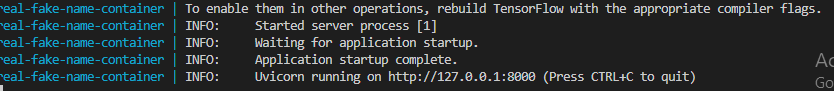
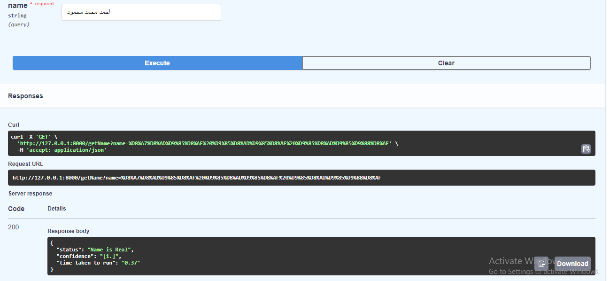
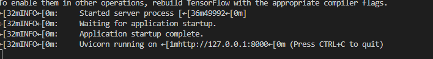
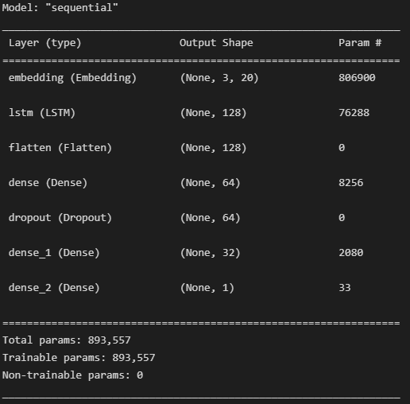

# Real-Fake-Names
 This a project of creating a machine learning model that takes a text of three words (name) and verify if it is correct name with a confidence threshold of your prediction


you have to install python > 3.8.0, you can download python for windows from here: https://www.python.org/downloads/windows/

### To run the docker image
```
docker-compose build
docker-compose up
```
The project will run and you will find the the link of API to test the project  
    
Go to the link in the screen shot ```http://127.0.0.1:8000/docs``` to open the swager of FastAPI and text the model like the below picture   
    


### To run the project using virtual environemnt 
```
python -m venv env   
cd env  
cd Scripts  
activate  

pip install -r requirements.txt  

uvicorn serve:app  
```
The project will run and you will find the the link of API to test the project  


### Run the streamlit app on localhost after install the virtual environment 
```
cd Streamlite  
streamlit run app.py
```
### Run the trainning script in Helpers file 
```
python train.py
```
### Run the test script found in Helpers file using CMD

```
python test.py --text use_your_text
```
## About Dataset.
### 1- Data Generation
I used a random generation to genrate the dataset I used two ways:  
1- I created a random real names where the second and last name must be a ``` Male``` names.  
2- I created a random fake names where I made some wrong letters and made the last name and second name be a ``` Female``` names.   
3- The generated dataset consists of unique names no redundant names and consists of ``` 197627 row ```.    
4- You will find the dataset in  ```Data folder->final_names.csv```.   


#### 2-Data Preprocessing  
I made a normalization on the dataset where I replaced the following characters:    
1- ``` [إأآا] ``` to ``` ا ```  
2- ```ي``` to ``` ى ```  
3- ```ة``` to ```ه```  
4- ``` گ``` to ``` ك```  

  
 ## Approach model  
 ### LSTM approach:  
 I used a basic word embedding layer -> LSTM model -> then some denses  
 The final layer is sigmoid layer where I treated the probelm as a regression probelm where the ouput is confidense between 0 and 1    
 


 ## Conclusion 
  The model do will to undersatnd the dataset and made a good results where:  
  Training accuracy: 0.9723%  
  Testing accuracy: 0.9272%  
  
 ## Files Structure   

  
  Data -> for data files   
│  
└───Helpers -> conatine all helpers function nedded for this project    
│   │  
│   └───data_generation.py -> to genrate the data  
│   │    
│   └───loadModel.py -> to load the model and the tokenizer   
│   │  
│   └───normalizeText.py -> contain function to normalize the text  
│   │  
│   └───test.py -> contain code to test model in CMD  
│   │  
│   └───textPreprocessing.py -> contain text preprocessing as padding function  
│   │  
│   └───train.py -> contain code to train the model   
│       
└───machine_models -> conatin machine learning models and tokenizer model         
│       
└───models -> contain models function used by API                
│       
└───Notebooks -> contain my notebooks tries               
│   
└───routes -> contain API endpoints  
│   
└───Streamlite -> contain the strteamlit application  
│  
└───server.py -> it is the API file   
   

